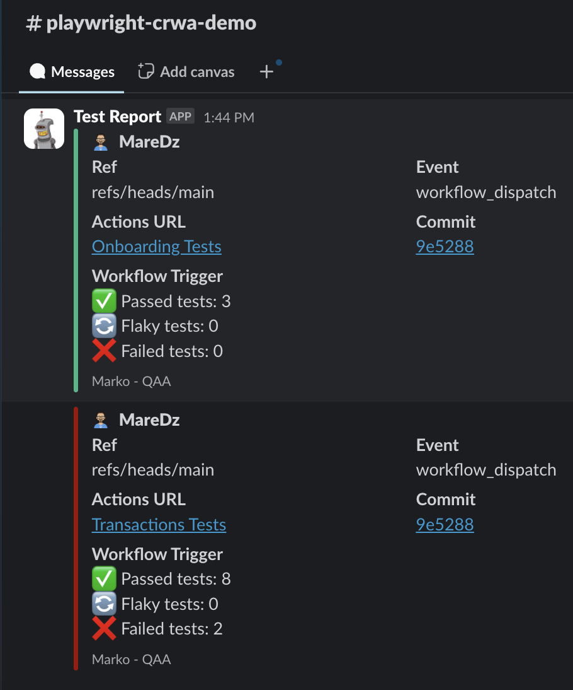

# Playwright E2E Testing on Cypress-RWA

---

# 1. Project Overview

## 📝 What is this Project?

This project is a **Playwright end-to-end (E2E) automation demo** created using the **Cypress Real World App (CRWA)** as the testing playground. It showcases a professional-level test suite that simulates real user scenarios in a banking web application.

The goal of this demo is to demonstrate:

- Playwright for UI and API automation
- Ability to test real-world features like transactions, bank accounts, login/logout, validation, etc.
- Proper use of Page Object Model (POM) for clean and maintainable code
- API integration for test data setup (using REST and GraphQL endpoints)
- Parallel test execution and session isolation

## 🎯 Purpose of the Project

The project serves as a **QA Automation portfolio piece** that highlights your skills in:

- Designing and writing scalable automation tests
- Building robust, real-world test cases
- Implementing test architecture and best practices

It's intended to be used for:

- QA engineers and developers who already have basic familiarity with Playwright
- Team members interested in reviewing a full end-to-end automation framework structure
- Those looking to explore different implementation patterns, including Page Object Model, reusable utilities, API integration, and CI integration
- Anyone aiming to compare or adopt practical testing strategies in real-world scenarios

## 💡 Why CRWA?

The [Cypress Real World App](https://github.com/cypress-io/cypress-realworld-app) is an open-source banking-style demo application designed specifically to mimic real production apps. It includes:

- Authentication
- Bank account creation
- Payments and requests
- Transaction history
- User profiles

Using CRWA allows you to automate realistic scenarios that hiring teams love to see — not just dummy click tests.

- **Note:** For full instructions on how to clone and run the CRWA app locally, please refer to their [GitHub repository setup guide](https://github.com/cypress-io/cypress-realworld-app).

---

## 🚀 1.0 Getting Started

### 1.1 Install Dependencies

After cloning the repository, install all required dependencies by running:

```bash
npm install
```

- This will install all Node.js packages defined in the package.json, including Playwright.

### 1.2 Install Playwright Browsers

Playwright installs all three browser engines (Chromium, Firefox, WebKit) by default.
However, since this project uses only Chrome (Chromium), you can install just that to save space and time.

```bash
npx playwright install chromium
```

- This will install only the Chromium engine, which is used by Chrome.
  Other browsers like Firefox and Safari (WebKit) will not be installed.

To install all browsers execute:

```bash
npx playwright install
```

- This will download Chromium, Firefox, and WebKit required for running tests, but we don't need it for this demo purpose

### 1.3 Start the CRWA App

Before running your Playwright tests, ensure the Cypress Real World App (CRWA) is running locally.
If you've cloned the CRWA repository separately, follow these steps:

1. Open a new terminal tab or window (separate from the one running your test project).
2. Navigate to the CRWA project directory:

```bash
cd path/to/crwa-repo
```
3. Install Cypress RWA
```bash
yarn 
```
4. Start the application using:
```bash
yarn dev
```

This will launch the app locally (usually on http://localhost:3000), which your tests rely on.

📝 Note: For full setup and usage details of the CRWA app, refer to their official GitHub repository setup [guide](https://github.com/cypress-io/cypress-realworld-app)

### 1.4 Running Tests

Precondition - CRWA running on http://localhost:3000

In this project, several scripts are defined in the package.json file to simplify running Playwright tests. You can choose which script to run based on what you want to do.
Open your project’s package.json file and look for the "scripts" section. It will look something like this:

```bash
  "scripts": {
    "all:test": "ENV=test npx playwright test tests/ --config=playwright.config.ts --project=Chromium",
    "registration:test": "ENV=test npx playwright test tests/Registration.spec.ts --config=playwright.config.ts --project=Chromium",
    "login:test": "ENV=test npx playwright test tests/Login.spec.ts --config=playwright.config.ts --project=Chromium",
    "onboarding:test": "ENV=test npx playwright test tests/Onboarding.spec.ts --config=playwright.config.ts --project=Chromium",
    "myAccount:test": "ENV=test npx playwright test tests/MyAccount.spec.ts --config=playwright.config.ts --project=Chromium",
    "bank:test": "ENV=test npx playwright test tests/BankAccount.spec.ts --config=playwright.config.ts --project=Chromium",
    "transactions:test": "ENV=test npx playwright test tests/Transactions.spec.ts --config=playwright.config.ts --project=Chromium"
  }
```

💡 How to Run a Script
In your terminal, use the following syntax:

```bash
npm run <script-name>
```

## 📁 2.0 Project Structure

```
rwa-qaa
 ┣ .git
 ┣ .github
 ┣  ┗ workflows
 ┣    ┣ BankAccount.yml
 ┣    ┣ Registration.yml
 ┣    ┗ ...
 ┣ node_modules
 ┣ pages
 ┃ ┣ Base.ts
 ┃ ┣ BasePage.ts
 ┃ ┣ TransactionDetailsPage.ts
 ┃ ┗ ...
 ┣ playwright-report
 ┣ state
 ┃ ┣ Global.ts
 ┃ ┗ UserModel.ts
 ┣ test-results
 ┣ tests
 ┃ ┣ BankAccount.spec.ts
 ┃ ┣ Registration.spec.ts
 ┃ ┗ ...
 ┣ utils
 ┃ ┣ apiHelpers.ts
 ┃ ┣ fnHelpers.ts
 ┃ ┗ playwrightFixtures.ts
 ┣ package.json
 ┣ playwright.config.ts
 ┗ ...
```

### 2.1 Folder & File Explanations

**.github/workflows/** - This folder contains GitHub Actions workflow files used to automate test execution in CI (Continuous Integration) pipelines.

**pages/** – Contains Page Object Model (POM) files. Each file represents a specific page/component and encapsulates locators and actions.

📌 For a full explanation of the POM architecture, naming conventions, and examples refer to the [Page Object Model Guide](https://github.com/MareDz/POM-PW-Guide)

**tests/** – Contains Playwright spec files grouped by feature (e.g., registration, bank account).

- Example: BankAccount.spec.ts tests creation and validation of user bank accounts.

---

**state/** – Handles in-memory test data used during test execution. It includes models and objects that store and manage test context such as generated user data, account balances, and other values.

- TestContext approach guarantees test isolation by giving each test its own clean state, easy sharing between classes and external functions, supporting parallel execution and avoiding shared state issues.

📌 For a full explanation of test context management (ctx) and how it's used with Playwright fixtures, refer to the [Test Isolation And Test Context Guide](https://github.com/MareDz/TestIsolation-PW-Guide)

---

**utils/** - Helper modules to support tests and reduce duplication.

- `apiHelpers.ts` – API calls like user creation, login, and bank setup.
- `fnHelpers.ts` – Helpers function of general purpose.
- `playwrightFixtures.ts` – Extends Playwright’s test with custom fixtures (e.g., Page Objects, ctx data).

---

**root/**

- `playwright.config.ts` – Global Playwright settings like test timeout, reporter, and base URL.
- `playwright-report/` & `test-results/` – Auto-generated Playwright reports and artifacts.
- `.env.test` (optional) – Environment-specific variables for tests (e.g., base URL, API keys).
- `package.json` – Project dependencies and available test scripts.

⚠️ NOTE: In real-world automation frameworks, you would typically have a separate **env/** or **config/** folder containing multiple environment-specific .env files (e.g., `.env.dev`, `.env.staging`, `.env.prod`). **These files store sensitive variables such as API keys, credentials, and base URLs. Make sure to include them in your .gitignore file to prevent accidental commits of private information.**

## 🧪 3.0 Test Approach

This section outlines the testing approach used for the Playwright-based automation of the Cypress Real World App (CRWA). It explains how tests are organized, structured, and executed, along with how test data is handled to ensure isolation and reproducibility.

### 3.1 Key Elements of the Approach:

- **Framework:** Built with Playwright Test using TypeScript.
- **Test Isolation:** Each test uses an in-memory `ctx` (test context) to avoid shared state and ensure clean environments per test run.
- **Page Object Model (POM):** The test logic is separated from selectors and actions using the Page Object pattern to maintain clean, reusable code.
- **Fixtures:** Custom Playwright fixtures manage context and page object creation for each test, injected automatically.
- **Parallel Execution:** The test suite is configured for parallel execution to speed up test runs.
- **End-to-End Scope:** Focused on simulating realistic user flows including registration, onboarding, transactions, acc ount management, etc.
- **Reporting:** Playwright HTML reports and test result tracking included via `playwright-report/`.

🔍 **Note:** For the purpose of this demo, we focused on automating the most critical and commonly used parts of the application — including user registration, bank account creation, and money transactions — to showcase real-world QA practices without overwhelming complexity.

## 🧾 4.0 Test Cases

- All manual test cases used to design and guide automation are documented in a shared spreadsheet.
- You can download them `root/support-recources/RWA Test Cases.xlsx` or just click here: 📥 [Test Cases (Excel)](https://github.com/MareDz/rwa-qaa/blob/main/support-recources/RWA%20Test%20Cases.xlsx)

⚠️ Note: These test cases do not represent all possible scenarios for the CRWA application.
This is a demo project, and the test cases are intentionally limited in scope to demonstrate: (Overall test desi, Page Object Model usage, Code organization and naming conventions, Basic CI setup and execution)

## 🐞 5.0 Known Issues

🟥 Two test cases consistently fail due to bugs in the CRWA application itself. These are highlighted in spec file with short comments for better understanding.

All discovered bugs are documented in a shared spreadsheet alongside the manual test cases.

- Found bugs are documented in a shared spreadsheet allong with manual test cases
- You can download them `root/support-recources/RWA Test Cases.xlsx` or just click here: 📥 [Bug Reports (Excel)](https://github.com/MareDz/rwa-qaa/blob/main/support-recources/RWA%20Test%20Cases.xlsx)

## 🚀 6.0 CI/CD Integration

This project integrates **GitHub Actions** to automate test execution.

- Each test suite (e.g., Registration, Bank Account) has a dedicated workflow file under `.github/workflows/`.
- Tests are run using **Playwright** in a **headless Chromium browser**.
- The CRWA app is cloned and started in the background for each run.
- Custom workflows can be triggered manually or extended to run on `push`, `pull_request`, or on schedule.

🔐 Environment variables are securely handled using **GitHub Secrets**.

📦 After each run, a Slack notification is sent containing a summary of test results — including the number of passed, failed, and flaky tests. The message also includes the name of the pipeline and a direct link to the Playwright test report artifact for quick access and debugging.


